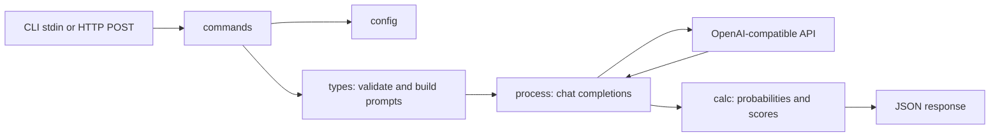

# Project Overview

Jeb evaluates JSON questions against a supplied state using an OpenAI-compatible chat
completions API. It runs as a CLI that reads one request from stdin or as an HTTP service at
`POST /v1/systemone`, returning answers, probabilities or scores, and token usage.

## Repository Structure

- `main.go` starts the Cobra CLI.
- `pkg/commands/` defines CLI commands, configuration flags, and the HTTP handler.
- `pkg/config/` loads and validates defaults, YAML, environment variables, and CLI overrides.
- `pkg/types/` defines request, response, and upstream API types and builds model prompts.
- `pkg/prompts/` embeds the system prompt from `system.md`.
- `pkg/process/` sends concurrent chat completion requests and assembles answers.
- `pkg/calc/` calculates probabilities, confidence, scores, and Yes probabilities.
- `pkg/utils/` holds a nil-check helper.
- `pkg/version/` provides build metadata and an optional GitHub release check.
- `examples/` contains sample JSON requests and usage instructions.
- `bin/` holds the ignored local build output.
- `.github/workflows/` builds Docker images and cross-platform binaries in CI.
- `Justfile`, `Dockerfile`, `go.mod`, `go.sum`, and `config.example.yaml` define build tasks,
  the container image, dependencies, and an example configuration.
- `README.md` is currently empty.

## Build & Development Commands

Use Go 1.27.1 as specified by `go.mod`. Install dependencies:

```sh
go mod download
```

Build and run the CLI or server:

```sh
just build
just serve
go run . < examples/choice.json
go run . -m qwen3.5:9b < examples/mixed.json
```

Run the available checks:

```sh
go test ./...
go vet ./...
go build ./...
gofmt -l .
```

For local debugging, run an example with a reachable OpenAI-compatible provider and inspect
stderr or the server request log:

```sh
go run . < examples/mixed.json
```

Build and run the container locally:

```sh
docker build -t jeb .
docker run --rm -p 6102:6102 jeb
```

Docker images are published to GHCR on `main` and `v*` tags; tagged binary archives are
published as GitHub releases. No deployment target is configured.

## Code Style & Conventions

- Format Go files with `gofmt`; use standard Go package and exported-identifier naming.
- Keep packages under `pkg/` aligned with their current responsibilities.
- Use `snake_case` JSON and YAML fields, as in the existing request types and example config.
- Add CLI commands in `pkg/commands/`; `just add command` invokes `cobra-cli add {{command}}`.
- No dedicated linter configuration or commit-message template is present.

> TODO: Define the required linter and commit-message format.

## Architecture Notes



The CLI accepts one JSON request; the HTTP handler accepts a request body at `/v1/systemone`.
Configuration comes from built-in defaults, optional `config.yaml`, environment variables,
and explicit CLI flags, in that order of increasing precedence. Each named question becomes a
chat completion request. `pkg/process/` limits simultaneous requests with
`concurrency.max_requests`, then combines the answers and token counts. The provider must return
token log probabilities for answer calculation.

## Testing Strategy

- Unit: no test files are present; add Go `*_test.go` files beside the code they cover and run
  `go test ./...`.
- Integration: use `examples/*.json` with a running compatible provider to exercise the CLI;
  no automated integration harness is present.
- End to end: run `just serve` and send a JSON request to `POST /v1/systemone`; no automated
  end-to-end suite is present.
- CI: the crossbuild workflow runs `go test ./...` and `go vet ./...` before compiling binaries;
  the Docker workflow builds an image on pull requests.

> TODO: Add automated tests beyond compilation and static analysis.

## Security & Compliance

- Keep API keys out of source control. Use `OPENAI_API_KEY` or a local config file for secrets;
  `config.example.yaml` contains an empty placeholder.
- `config.yaml` is not ignored by the current `.gitignore`; check tracked and untracked files
  before committing local secrets.
- The HTTP server has no authentication or TLS in this repository; control access at deployment.
- No dependency scanner, license file, or compliance policy is present.

> TODO: Define dependency scanning, license terms, and deployment security requirements.

## Agent Guardrails

- Do not commit credentials, populated local config files, or generated `bin/` artifacts.
- Preserve the JSON request and response shapes and the CLI and HTTP entry points when editing.
- Run the relevant Go checks for changed code; validate provider-dependent behavior with a
  compatible provider when available.
- Respect the configured `JEB_MAX_REQUESTS` limit and the provider's rate limits during manual
  testing.
- No repository-specific protected-file list or required review policy is documented.

> TODO: Define files that agents must never touch and changes requiring human review.

## Extensibility Hooks

- Add CLI commands through Cobra in `pkg/commands/`; `just add command` scaffolds a command.
- Add question types through `pkg/types/` prompt creation and `pkg/process/` response assembly.
- Change provider settings with `OPENAI_BASE_URL`, `OPENAI_API_KEY`, `OPENAI_MODEL`,
  `OPENAI_MAX_TOKENS`, `OPENAI_REASONING_EFFORT`, `OPENAI_TEMPERATURE`, `OPENAI_TIMEOUT`, and
  `OPENAI_MAX_RETRIES`.
- Change service settings with `JEB_HOST`, `JEB_PORT`, `JEB_MAX_REQUESTS`, and
  `JEB_CONFIG_FILE`; see `config.example.yaml` for defaults and YAML locations.
- No feature-flag system is present.

## Further Reading

- [Example requests](examples/README.md)
- [Example configuration](config.example.yaml)
- [Build tasks](Justfile)
- [Container build](Dockerfile)

> TODO: Add architecture documentation and ADRs if those are introduced.
